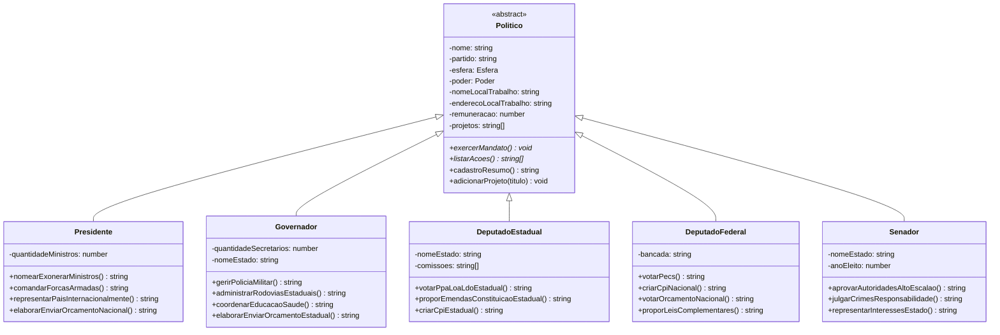

# Sistema de Cadastro de Políticos — Eleições 2026

Atividade de Programação 2 (POO) — IFPE Campus Jaboatão dos Guararapes.

Implementação em **TypeScript** dos quatro princípios da Programação Orientada a Objetos:

| Princípio | Onde aparece |
|---|---|
| **Abstração** | Classe abstrata `Politico` + métodos abstratos `exercerMandato()` e `listarAcoes()` |
| **Encapsulamento** | Atributos `private` com getters/setters e validações |
| **Herança** | `Presidente`, `Governador`, `DeputadoEstadual`, `DeputadoFederal` e `Senador` estendem `Politico` |
| **Polimorfismo** | Cada subclasse implementa o mandato e as ações de forma diferente; `demonstrar(politico: Politico)` trata todos pelo tipo base |

## Diagrama de classes



## Como executar

```bash
npm install
npx ts-node src/main.ts
```

Ou, se preferir compilação:

```bash
npx tsc
node dist/main.js
```

## Instâncias (situação em setembro/2026)

- **Presidente:** Luiz Inácio Lula da Silva (PT)
- **Governadores:** Raquel Lyra (PSD-PE) e Tarcísio de Freitas (Republicanos-SP)
- **Deputados federais PE:** Pedro Campos (PSB), Clarissa Tércio (PP), Carlos Veras (PT)
- **Deputados federais SP:** Tabata Amaral (PSB), Kim Kataguiri (UNIÃO)
- **Deputados estaduais PE:** Delegada Gleide Ângelo (PSB), João Paulo (PT), Antônio Coelho (UNIÃO)
- **Deputados estaduais SP:** André do Prado (Republicanos), Emídio de Souza (PT)
- **Senadores:** Humberto Costa (PT-PE, eleito 2010), Teresa Leitão (PT-PE, eleita 2022), Flávio Bolsonaro (PL-RJ, eleito 2018)

Remunerações usadas: teto federal R$ 46.366,19 (presidente, deputado federal e senador); deputado estadual 75% desse valor; governador de PE R$ 22.000,00; governador de SP R$ 36.301,53.
